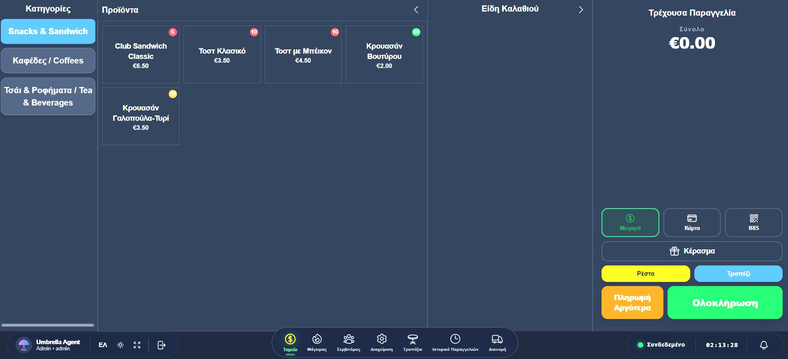
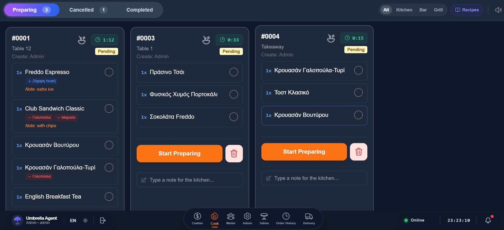
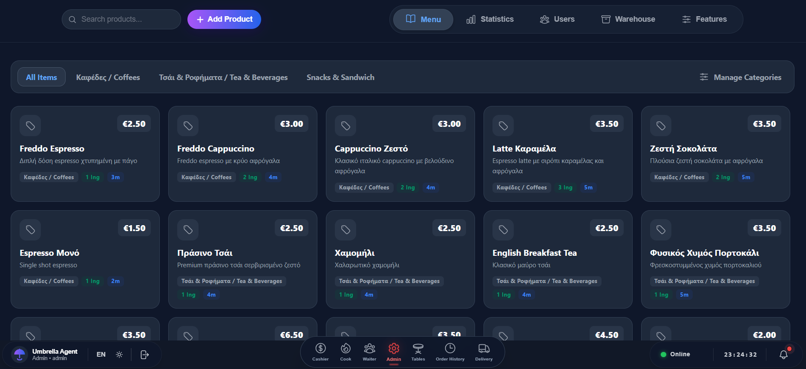
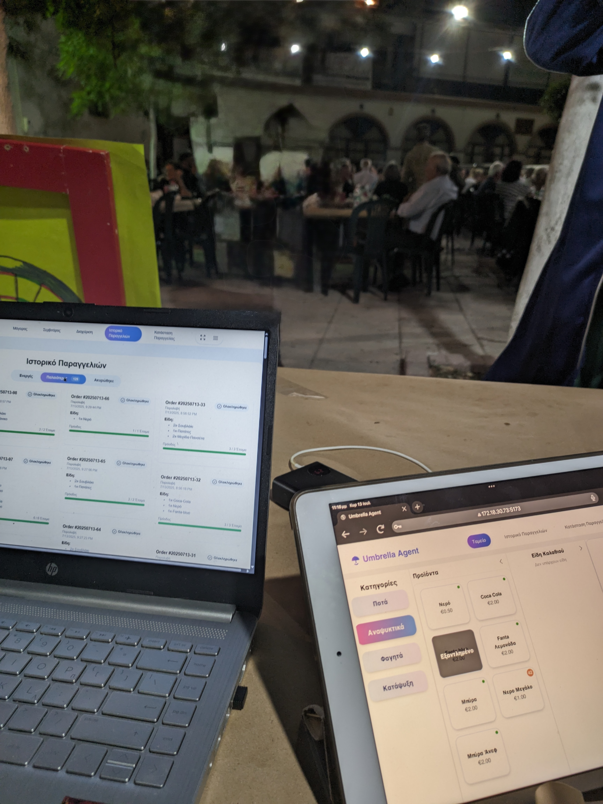

# UmbrellaAgent: A Local-First, Event-Driven Order Management System

Welcome to the presentation repository for **UmbrellaAgent**. 

This repository serves as a visual and descriptive showcase of the application developed as the foundation for our academic research, published in the IEEE SEEDA 2026 conference under the title:  
**"A Local-First Event-Driven Order Management System for Temporary Events"**.

> **Note:** This repository is dedicated to presenting the application's interface, capabilities, and real-world execution. It does not contain the proprietary source code of the application itself.

---

## 📖 The Vision: Why UmbrellaAgent?

UmbrellaAgent was designed specifically for high-density, temporary event environments—such as music festivals, beach bars, and pop-up events—where external internet connectivity is often unreliable, yet the volume of transactions is massive and concentrated.

To solve the challenges of connectivity drop-outs and server overload, UmbrellaAgent replaces traditional HTTP request-response polling with a **Local-First** architecture utilizing bidirectional **WebSockets**. This allows for:
- **Instantaneous UI Synchronization** across all devices (Point of Sale, Kitchen Display, Cashier).
- **Server-Authoritative LAN-Local Operations**, meaning the system operates flawlessly even if the external cloud connection goes down.
- **High Concurrency**, managing burst transactional loads gracefully without race conditions.

---

## 🎥 The System in Action (Video Demonstration)

The following video demonstrates the complete real-time processing workflow of UmbrellaAgent. Notice the sub-second latency from order creation at the POS to the ticket appearing on the Kitchen Display System (KDS), a direct result of our WebSocket architecture.

*(Click to play the video demonstration)*

<video src="./videos/Umbrella-Agent.MP4" controls="controls" style="max-width: 100%; width: 100%;">
  Your browser does not support the video tag. <a href="./videos/Umbrella-Agent.MP4">Download the video here</a>.
</video>

---

## 💻 The Interfaces: A Journey of an Order

UmbrellaAgent features role-specific interfaces built on our custom **Eclipse UI** design system, ensuring fast, frictionless interactions during high-pressure scenarios. Here is how the system handles the lifecycle of an order:

### 1. Order Entry (Point of Sale)
The journey begins at the POS. Designed for extreme speed, this interface allows cashiers and waiters to punch in complex orders rapidly without waiting for server round-trips.

### 2. Order Preparation (Kitchen Display System)
As soon as the order is confirmed, it instantly appears on the KDS. The kitchen staff receives real-time updates, ensuring zero delays in preparation.

### 3. Management & Analytics (Admin Dashboard)
Behind the scenes, managers use the Admin interface to track live analytics, monitor stock levels, and manage users—all synchronized in real-time.

---

## 🌍 The Challenge & Real-World Validation

### The Environment: High-Density & High-Throughput
UmbrellaAgent is built specifically to handle extreme transactional loads in crowded, fast-paced environments. The image below illustrates the immense volume of people and the high-throughput nature of the events our system targets.

*(Reference: Visualizing the massive scale and crowd density that demands a Local-First, high-throughput architecture).*

### Live Field Testing
To validate our research, UmbrellaAgent was deployed in live, real-world conditions. The photograph below captures the system in action during a live event—with the UmbrellaAgent interface actively running on the terminal in the foreground, while the party takes place in the background.

*(UmbrellaAgent operating seamlessly in the field without relying on external internet connectivity).*

Our research and subsequent field testing validated several core architectural decisions:
- **Performance & Scalability:** Through rigorous synthetic stress tests (via Apache JMeter), the WebSocket duplex stream architecture successfully sustained over **1.58M requests** without failure.
- **Uncompromised Resilience:** Utilizing Chaos Engineering methodologies, we verified a Recovery Time Objective (RTO) of **under 5 seconds** during severe network disruptions.

---

## 👨‍💻 Authors

This research and application were developed in collaboration with the **Department of Informatics and Telecommunications at the University of Ioannina, Greece**.

- **George Petrakis** (petrakisgeorge@icloud.com)
- **Spiridoula Margariti** (smargar@uoi.gr)
- **Christos Gogos** (cgogos@uoi.gr)

---

## 📜 License & Usage
The contents of this repository (including images, videos, and descriptions) are provided for academic reference, review, and demonstration purposes surrounding the IEEE SEEDA 2026 conference.

*University of Ioannina - Department of Informatics and Telecommunications (Arta, Greece)*
